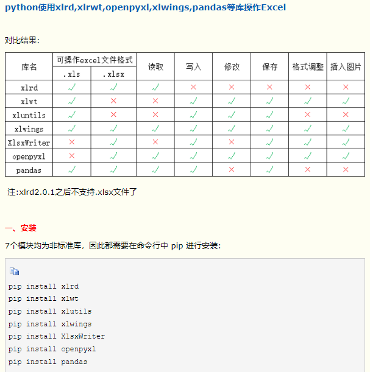

>一些操作的时间复杂度总结
>* O(1) ：集合、字典增删元素，查找元素，以关键字作为下标访问字典元素的值，列表添加元素到末尾（append），列表、字符串、元组根据下标访问元素
>* O(n): 列表、元组查找元素(in,index)，列表插入元素(insert)、删除元素(remove) 计算出现次数(count）
>* O(nlog(n)): python自带排序 sort,sorted
>* O(log(n)): 在排好序的列表或元组上进行二分查找（初始的查找区间是整个元组 或列表，每次和查找区间中点比较大小，并缩小查找区间到原来的一半。类似于查英 语词典）有序就会找得快！
> 
> 